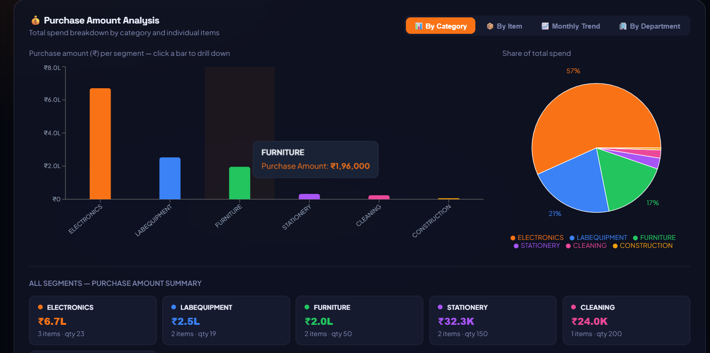
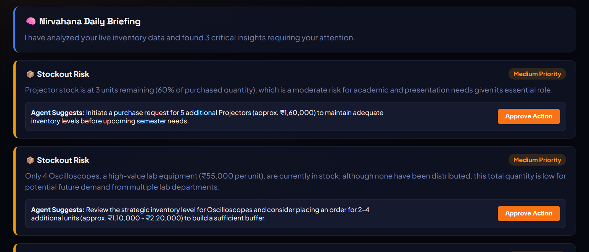
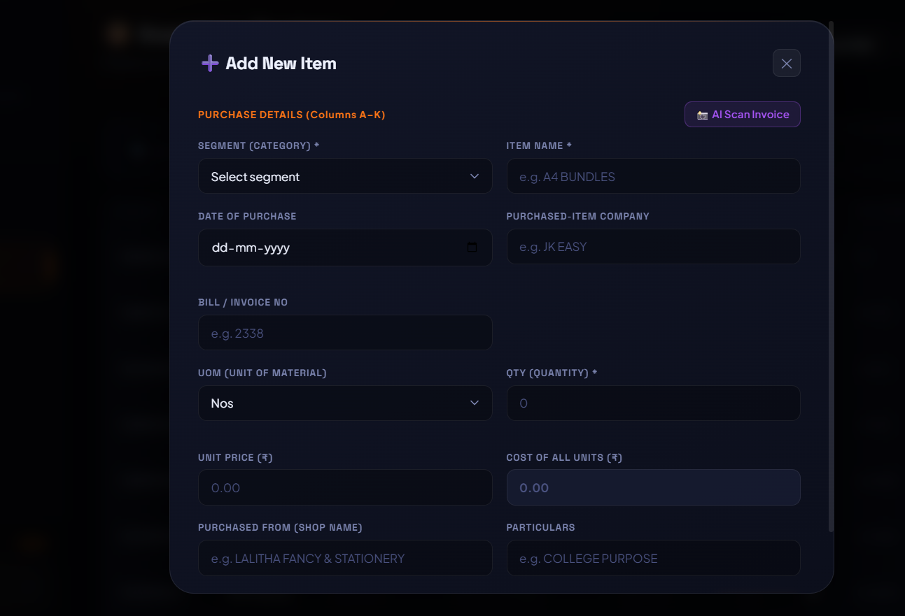
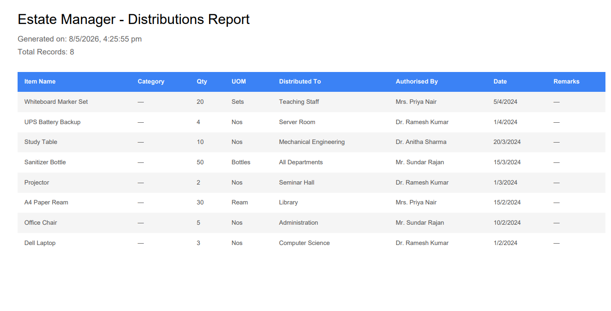
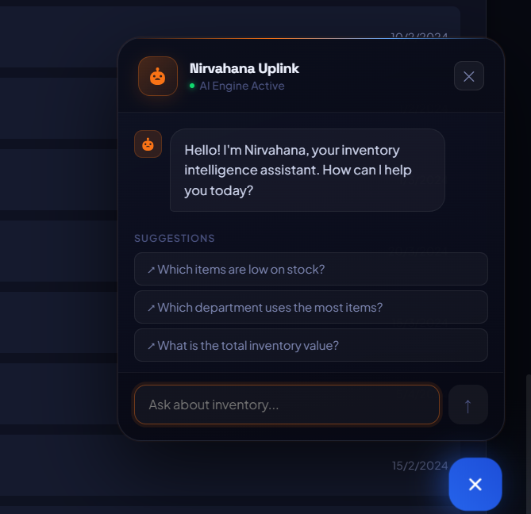

# 🏛️ College Estate Manager & Nirvahana AI — Premium Inventory System

A next-generation, AI-powered full-stack web application for managing college inventory with autonomous tracking, predictive forecasting, and role-based access control.

---

## 🌟 Key Features

### 🧠 Nirvahana AI Integration
- **Autonomous Agent**: Scans inventory continuously in the background to detect stockouts, low stock, and unusual consumption patterns.
- **Financial Forecasting**: AI predicts 30-day budget consumption based on historical velocity.
- **Smart Alerts**: Dashboard alerts with one-click "Approve Action" that auto-drafts purchase order emails to vendors.
- **Automated WhatsApp Notifications**: Critical stock anomalies are instantly pushed to the Estate Manager via WhatsApp.
- **AI Invoice Scanning (Vision)**: Upload a photo of a vendor invoice and let AI automatically extract the Item Name, Quantity, Price, and Vendor details.

### 📊 Advanced Dashboard & Analytics
- **Dynamic Recharts**: Interactive Pie and Bar charts with drill-down capabilities by Category and Department.
- **Budget Tracking**: Department-wise consumption vs. allocated budget progress bars.
- **Live Stock Bar**: Visual indicators (Green/Yellow/Red) showing exact remaining stock levels against total purchased.

### 📦 Comprehensive Inventory Management
- **QR Code System**: Auto-generates QR codes for every item. Includes a built-in QR Scanner for lightning-fast distributions.
- **Bulk Import/Export**: Import thousands of records via Excel (`.xlsx`), or generate styled PDF Reports with one click.
- **Master Data**: Dedicated UI to manage Vendors, Departments, and Particulars.

### 🔐 Security & Access Control
- **Role-Based Access**: 
  - **Admin**: Full access (Manage users, settings, and master data).
  - **Estate Manager (Staff)**: Handle daily inventory tasks, view AI insights.
  - **Viewer**: Read-only dashboard access.
- **Rate Limiting & Security**: Helmet, express-mongo-sanitize, and rate-limiting to protect API routes.

---

## 📸 Screenshots

### 1. Dashboard Overview


### 2. Smart Alerts & Forecasting


### 3. Inventory Register


### 4. Distributions Report


### 5. AI Chart Bot


---

## 🚀 Quick Start (Local Development)

### Prerequisites
- **Node.js** (v18+)
- **MongoDB** (Local or Atlas URI)

### Step 1 — Setup Backend
```bash
cd backend

# Copy environment file and fill in your keys (Gemini API, WhatsApp API, MongoDB URI)
cp .env.example .env

# Install dependencies
npm install

# Start the backend server
npm run dev
```

### Step 2 — Setup Frontend
Open a **new terminal window**:
```bash
cd frontend

# Install dependencies
npm install

# Start the React app
npm start
```
Browser will open at **http://localhost:3000**

---

## 🌐 Deployment (Production)

This project is optimized for deployment on modern platforms:

- **Frontend (Vercel)**: Automatically configured with `vercel.json` for React Router SPA fallbacks.
- **Backend (Render / Railway)**: Ready to run via `npm start`. Ensure `TRUST_PROXY=true` is set in your environment variables.

---

## 🛠️ Tech Stack

| Layer | Technology |
|-------|-----------|
| **Frontend** | React 18, React Router, Recharts, HTML5-QRCode, jsPDF |
| **Styling** | Custom Premium Vanilla CSS (Glassmorphism, Dark Theme) |
| **Backend** | Node.js, Express.js |
| **Database** | MongoDB + Mongoose |
| **AI Integration**| Google Generative AI (Gemini Flash) |
| **Auth & Security**| JWT, bcryptjs, Helmet, Express Rate Limit |

---

## 📊 Stock Formula

```
Remaining Stock = Total Quantity Purchased - Total Quantity Distributed
```

Each item visually indicates its health:
- 🟢 **In Stock** — plenty available
- 🟡 **Low Stock** — 5 or fewer units remaining
- 🔴 **Out of Stock** — 0 units remaining

---

## 📝 License
Proprietary / Internal College Use Only.
